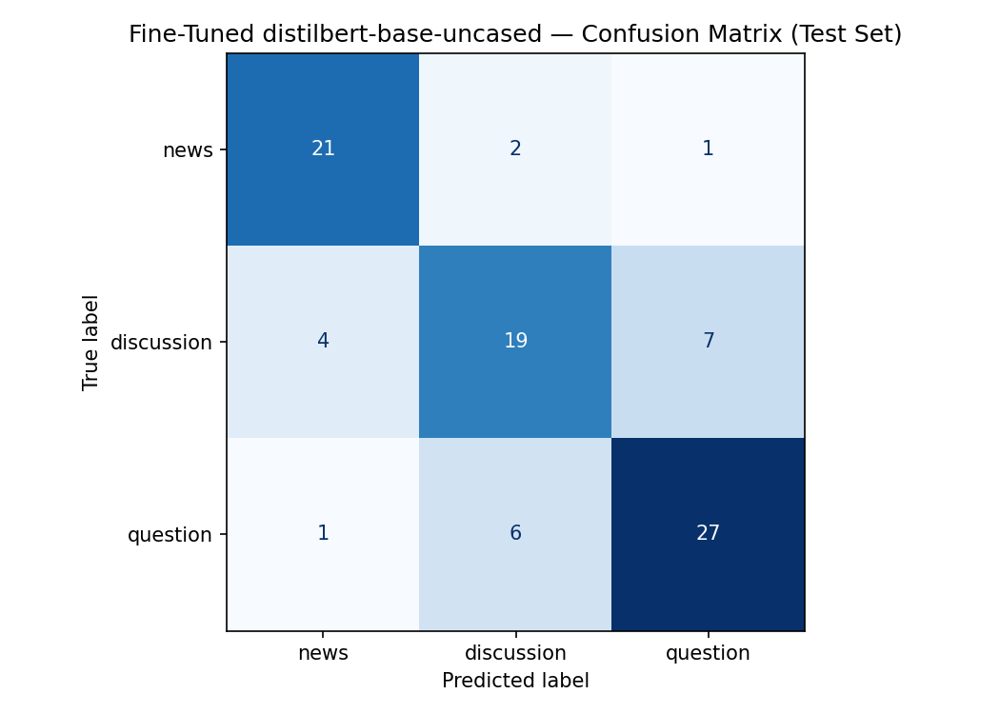

# TakeMeter - Project 3

> A fine-tuned text classifier that labels r/QuantumComputing posts as `news`, `discussion`, or `question`.
> Built on `distilbert-base-uncased`, trained on a curated Reddit dataset, and compared against a Groq zero-shot baseline.

---

## What's Included

```text
week-3/
├── data/
│   ├── dataset.csv          # Smaller balanced dataset, 234 rows
│   └── dataset_600.csv       # Final curated dataset, 583 rows
├── ai201_project3_takemeter.ipynb
├── ai201_project3_takemeter_starter_clean.ipynb
├── confusion_matrix.png
├── evaluation_results.json
├── planning.md
├── taxonomy.md
├── dataset.md
└── README.md
```

---

## Setup

Open `ai201_project3_takemeter.ipynb` in Colab.

1. Go to **Runtime -> Change runtime type** and select **T4 GPU**
2. Add `GROQ_API_KEY` in Colab Secrets
3. Upload `data/dataset_600.csv` when prompted
4. Run the notebook top to bottom

The notebook generates:

```text
confusion_matrix.png
evaluation_results.json
```

---

## Community

**Community:** r/QuantumComputing

r/QuantumComputing is a good fit because the posts are text-heavy and the intent usually matters more than the topic. A post can mention IBM, Grover, Qiskit, or quantum hardware, but the real question is what the author is doing with that content.

The classifier tries to separate three common intents:

- sharing an update
- starting a debate
- asking for an explanation

That made the task interesting because the labels are not just keyword buckets.

---

## Labels

### `news`

The post mainly shares an external announcement, paper, article, company update, course, tool, event, or industry development.

The value is mostly in the linked content, not the poster's own argument.

Examples:
```text
QC Hack 2021 | April 5-11 | Free | Yale x Stanford co-hosted
QpiAI Achieves High-Speed Quantum Error Correction on Superconducting Systems
```

### `discussion`

The author has a claim, take, concern, prediction, or observation they want the community to debate.

There is no single clean answer. The post is useful because people can disagree.

Examples:
```text
When will SC qubits start to die off?
What do you think of QuEra's 'Fault-tolerance in 2028' — is it a bold claim?
```

### `question`

The author is missing some understanding and wants an explanation.

One informed person could answer it with a known concept, source, or standard explanation.

Examples:
```text
Why don't we just perform another transform in the Fourier basis after QFT?
I don't get generalized amplitude damping
```

---

## Dataset

The final notebook uses:

```text
data/dataset_600.csv
```

It has 583 rows:

| Label | Count |
|---|---:|
| `news` | 160 |
| `discussion` | 197 |
| `question` | 226 |

The smaller `data/dataset.csv` has 234 rows, balanced at 78 examples per class. It is kept as a cleaner starter-sized dataset, but the final result uses `dataset_600.csv`.

The biggest issue was label quality. The first pass had posts labeled by surface clues, like question marks or news keywords. That created bad training examples. For example, a hackathon post could be labeled `question` just because it asked for teammates, or a link post could be labeled `news` even when the body was really an opinionated take.

I manually reviewed `dataset_600.csv` row by row and fixed those cases using the rule from `taxonomy.md`:

```text
If one informed person can answer it, label it question.
If the post needs community judgment, label it discussion.
If the link or announcement is the main value, label it news.
```

That cleanup mattered more than model tuning.

---

## Model

The used model is:

```text
distilbert-base-uncased
```

Training setup:

| Setting | Value |
|---|---:|
| Max sequence length | 384 |
| Epochs | 6 |
| Learning rate | 2e-5 |
| Batch size | 16 |
| Weight decay | 0.02 |
| Best checkpoint metric | Macro F1 |
| Early stopping patience | 2 |

Hyperparameter changes from defaults:

- Changed max sequence length from 256 to 384 because Reddit bodies often contain the context needed to separate `question` from `discussion`.
- Changed epochs from 3 to 6 because the validation macro F1 was still improving after the default 3 epochs.
- Changed weight decay from 0.01 to 0.02 to reduce overfitting on repeated subreddit patterns.
- Changed best checkpoint metric from accuracy to macro F1 because the goal is balanced performance across all three labels.
- Added early stopping with patience 2 so training stops if validation macro F1 stops improving.

I kept the model close to the starter notebook instead of using a bigger encoder. The point of the final run is to show what a small fine-tuned model can do after the data is cleaned.

---

## Baseline

The baseline is Groq zero-shot classification with:

```text
llama-3.3-70b-versatile
```

Prompt used (system message, temperature 0):

```text
You are classifying posts from the r/QuantumComputing subreddit.
Assign each post to exactly one of the following labels.

news: The post shares an external announcement, paper, or industry development.
The value comes from the linked content, not the poster's own argument or opinion.
The poster may add a brief reaction, but no original reasoning is built.
Example: "Microsoft's Majorana 2 Topological Quantum Computer"
Example: "QpiAI Achieves High-Speed Quantum Error Correction on Superconducting Systems"

discussion: The poster has a perspective, observation, or claim they want the community
to debate. No single correct answer exists — the post is valuable because it invites
expert opinions or analysis.
Example: "When will SC qubits start to die off?"
Example: "What do you think of QuEra's 'Fault-tolerance in 2028' — is it a bold claim?"

question: The poster lacks understanding of something and wants an explanation.
A single well-informed person could answer it correctly by citing a source, paper,
or established concept.
Example: "I don't get generalized amplitude damping"
Example: "Why don't we just perform another transform in the Fourier basis after QFT?"

Respond with ONLY the label name — nothing else.
Valid responses: news, discussion, question
```

This is a strong baseline because a 70B model already understands Reddit intent well. Every test example was parseable (88/88), so no results were lost to unparseable responses.

---

## Results

Test set size: 88 examples.

| Model | Accuracy | Macro F1 |
|---|---:|---:|
| Groq zero-shot baseline | 0.773 | 0.776 |
| Fine-tuned DistilBERT | 0.761 | 0.763 |

Fine-tuned DistilBERT per-class metrics:

| Label | Precision | Recall | F1 | Support |
|---|---:|---:|---:|---:|
| `news` | 0.81 | 0.88 | 0.84 | 24 |
| `discussion` | 0.70 | 0.63 | 0.67 | 30 |
| `question` | 0.77 | 0.79 | 0.78 | 34 |
| **Macro avg** | **0.76** | **0.77** | **0.76** | **88** |

Confusion matrix:



The DistilBERT achieve impressive results given small dataset size and small parameter count. It reach the performance of a 70B zero-shot model, and it is much faster to run.

---

## Error Analysis

The hardest class is `discussion`.

Most mistakes happen when a discussion post is written like a question. For example:

```text
When will we have Quantum Computing for general purpose compute?
```

This looks like a `question`, but it is asking for predictions and debate. That should be `discussion`.

Another hard case is when a post shares a link but adds a strong opinion. The model often treats the link as `news`, even when the real intent is discussion.

Examples from the wrong predictions:

| Post | True | Predicted | Why it is hard |
|---|---|---|---|
| `Microsoft quantum cloud breakthrough` | `news` | `discussion` | Link post with extra commentary |
| `OpenQASM vs Qiskit vs Cirq` | `discussion` | `question` | Advice wording, but subjective tradeoffs |
| `When will we have Quantum Computing for general purpose compute?` | `discussion` | `question` | Question grammar, debate intent |
| `Critique of Microsoft` | `discussion` | `news` | Link title, but asks for thoughts |

The model learned the surface features of each class well — link-heavy titles map to `news`, "how/why/what is" phrasing maps to `question` — but it learned syntax rather than intent for `discussion`. A `discussion` post is defined by the author wanting debate, which is not always visible in the title. The model cannot yet distinguish "When will X?" (debate prompt) from "How does X work?" (explanation request). It resolves the ambiguity by falling back on grammatical cues, which is wrong roughly half the time for that class.

The `discussion` label was the intended target of the classifier. The model captured two of the three labels well and partially missed the third — not because of data volume, but because `discussion` requires reading intent rather than structure.

---

## Error Pattern Analysis

Of the 21 wrong predictions, 9 (43%) are `discussion` posts misclassified as something else — by far the single most concentrated failure mode.

Two distinct sub-patterns account for all 9:

**Pattern 1 — question syntax, debate intent (5 cases)**

Posts framed grammatically as questions but asking for community predictions or opinions:

- "When will we have Quantum Computing for general purpose compute?" → predicted `question` (0.85)
- "OpenQASM vs Qiskit vs Cirq — which is better for learning?" → predicted `question` (0.73)
- "IBM Quantum unreliable" → predicted `question` (0.75)

The model keyed on interrogative phrasing and ignored the speculative/opinionated body. All five posts contain phrases like "when will", "which is better", or "what do you think" — surface patterns the model associates with `question`.

**Pattern 2 — link presence, opinionated body (4 cases)**

Posts that include an external link but whose main value is the poster's take, not the link:

- "Critique of Microsoft" (links arxiv paper, body says "Thoughts?") → predicted `news` (0.66)
- "You're Already Using Post-Quantum Ready Sites..." (argumentative body) → predicted `news` (0.74)
- "Shor's algorithm implementation on IBM quantum computer" → predicted `news` (0.75)

The model learned that link presence is a strong `news` signal. When a discussion post includes a link, the model overrides the body content.

**Root cause:** `discussion` is the only class defined by author *intent* rather than structural features. `news` has links. `question` has interrogatives. `discussion` has neither a consistent surface marker. The model needs enough examples where the structural cues are ambiguous to learn the intent signal — and 197 training examples was not enough for that boundary.

---

## Spec Reflection

**One way the spec helped:** The hard edge case rule in `planning.md` became the most important part of the project. It gave me a clear way to fix labels after the first model runs showed noisy errors.

**One way implementation diverged from the spec:** The original plan expected around 200 manually collected examples. The final version used a larger scraped dataset, then narrowed it down to 583 cleaner rows. That changed the project from simple data collection into data curation.

---

## Deployed Interface

A Gradio interface is available in `app.py`. It accepts a post, runs the fine-tuned model, and displays the predicted label and per-class confidence scores.

**Setup:**

1. Download the fine-tuned model from Colab (Files panel → right-click `takemeter-model/checkpoint-104` → Download as zip) and place it in `./model/`
2. Install dependencies: `pip install gradio transformers torch`
3. Run: `python app.py`

The interface launches at `http://localhost:7860`.

---

## AI Usage

**Instance 1 - data collection and cleanup**

I used Codex to help collect Reddit post data, separate image-only posts, and format the dataset into the `text`, `label`, `notes` schema. The raw scrape was not committed as final data. Only the curated CSV outputs are kept.

**Instance 2 - label review and model debugging**

I used Codex to inspect wrong predictions and find label problems. The biggest discovery was that many early "model errors" were actually bad labels. After that, I manually reviewed the dataset row by row and fixed the labels using `taxonomy.md`.

**Instance 3 - notebook tuning**

I used Codex to tune the Colab notebook while keeping the final model on DistilBERT. The final notebook uses longer input length, macro F1 checkpoint selection, early stopping, and the Groq baseline comparison.
